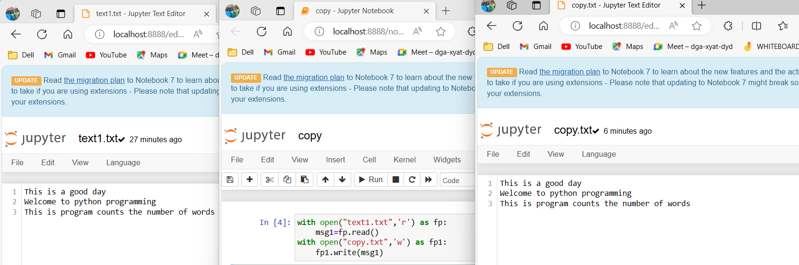

# EX09 COPY-FILE
## AIM:
To write a python program for copying the contents from one file to another file.
## EQUIPEMENT'S REQUIRED: 
PC
Anaconda - Python 3.7
## ALGORITHM: 
### Step 1:
Start the program.
### Step 2: 
Create two files text1.txt and copy.txt in anaconda navigator.
### Step 3: 
Write a program to copy the contents of a file to another file.
### Step 4:  
Run the program.
### Step 5: 
Print the output.
### Step 6: 
End the program.
## PROGRAM:
```
#Copy contents of a file 
#Developed by: HARINI R
#Register number: 212223100010
with open("text1.txt",'r') as fp:
    msg1=fp.read()
with open("copy.txt",'w') as fp1:
    fp1.write(msg1)
```
### OUTPUT:



## RESULT:
Thus the program is written to copy the contents from one file to another file.
